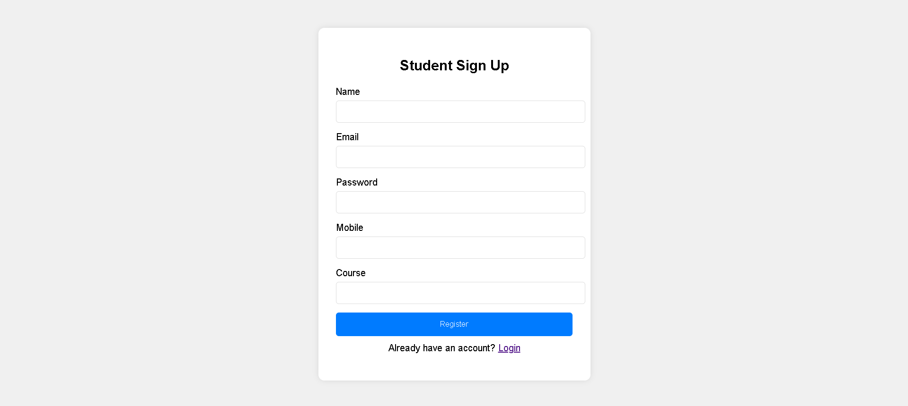
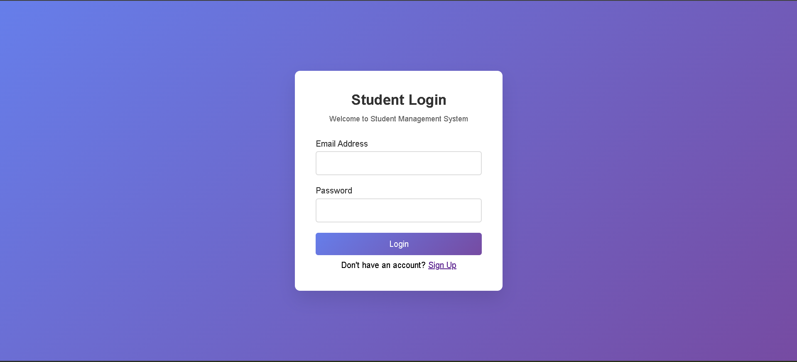
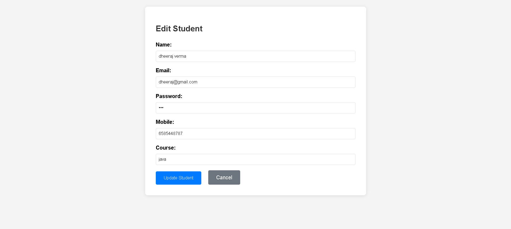
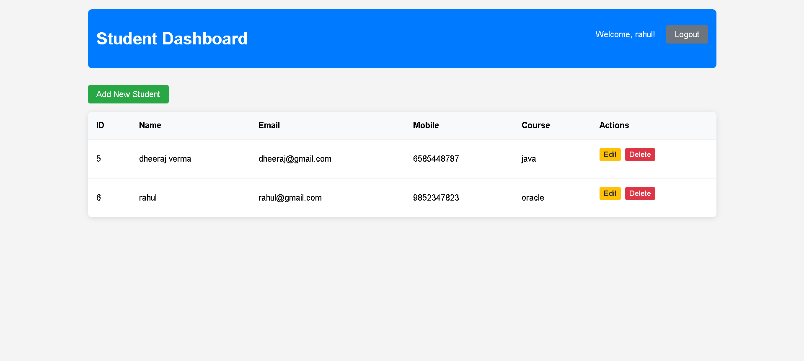

# 🎓 Student Management System - Java Servlet Project

A complete full-stack **Student Management System** built using:
- Java Servlets (Jakarta EE 10 / Servlet 6.x)
- Oracle Database (JDBC + ojdbc17.jar)
- HTML/CSS/JS (frontend)
- Deployed on Apache Tomcat 11

## 🚀 Features

✅ Student Login & Logout  
✅ Dashboard with Student List  
✅ Add / Edit / Delete Students  
✅ Session Management  
✅ Form Validation  
✅ Reusable JSPF includes  
✅ Secure Oracle DB Connection using `driverinfo.properties`

## 🖼️ Screenshots

### Student Sign Up


### Student Login


### Edit Student


### Student Dashboard



## 🛠️ Technologies Used

- Java 17+
- Jakarta Servlet API 6.1.0
- Oracle Database 21c
- Tomcat 11.x
- Eclipse IDE

## 📁 Folder Structure

```
StudentManagementSystem/
├── src/
│   └── com/student/
│       ├── dao/
│       ├── model/
│       ├── servlet/
│       └── util/
├── WebContent/
│   ├── WEB-INF/
│   │   ├── includes/
│   │   └── web.xml
│   ├── login.html
│   ├── dashboard.jsp
│   ├── add-student.html
│   ├── edit-student.jsp
│   └── error.jsp
├── driverinfo.properties
├── ojdbc17.jar
└── README.md
```

## 📝 How to Run

1. Clone the repo:
   ```bash
   git clone https://github.com/Dheerajdvn/StudentManagementSystem.git
   ```

2. Import into Eclipse as **Dynamic Web Project**

3. Add `ojdbc17.jar` and `jakarta.servlet-api-6.1.0.jar` to `WEB-INF/lib`

4. Configure Oracle DB connection inside `driverinfo.properties`

5. Deploy to **Tomcat 11** and run via `http://localhost:8080/StudentManagementSystem`

---

> 👤 Created by [Dheerajdvn](https://github.com/Dheerajdvn)
